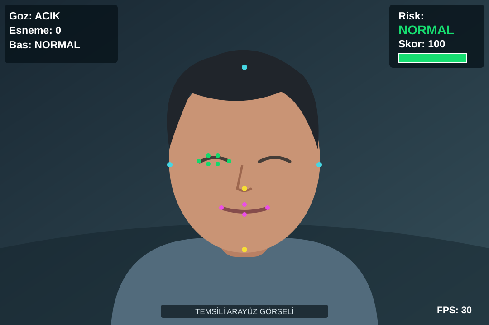

# Sürücü Dikkat Takibi

Web kamerasından alınan görüntüde sürücünün yüzünü izleyen; göz kapanması, esneme ve baş yönüne göre anlık uyarı, risk seviyesi ve dikkat skoru gösteren Python uygulaması.



> Görsel temsili bir çizimdir; gerçek kamera kaydı veya ekran görüntüsü değildir. Uygulama tek başına bir sürüş güvenliği sistemi olarak kullanılmamalıdır.

## Özellikler

- MediaPipe Face Mesh ile kameradaki ilk yüzün işaret noktalarını bulur.
- Sol gözün açıklık oranını (EAR) ve art arda kapalı kaldığı kareleri izler.
- Ağız açıklık oranından (MAR) tamamlanan esnemeleri sayar.
- Burun, alın, çene ve yanak noktalarından baş yönünü tahmin eder.
- Video üzerinde durum paneli, renkli risk seviyesi, 0–100 dikkat skoru, uyarı ve FPS gösterir.

## Gereksinimler

- Python ve `pip`
- Çalışan bir web kamerası (varsayılan kamera indeksi `0`)
- Kamera penceresini gösterebilen masaüstü ortamı

Doğrudan kullanılan paketler `opencv-python`, `mediapipe` ve `numpy`'dır. Proje yerel ortamda MediaPipe `0.10.9` ile incelenmiştir; kod `mp.solutions.face_mesh` arayüzünü kullanır.

## Kurulum ve çalıştırma

Windows PowerShell:

```powershell
python -m venv venv
.\venv\Scripts\Activate.ps1
python -m pip install "mediapipe==0.10.9" opencv-python numpy
python main.py
```

macOS/Linux ortamında sanal ortamı `source venv/bin/activate` ile etkinleştirin. Uygulama açıldığında kamera izni verin. Çıkmak için video penceresi seçiliyken **q** tuşuna basın.

## Ekrandaki bilgiler

| Alan | Anlamı |
| --- | --- |
| Göz | `ACIK`, `KAPALI` veya yüz bulunamadığında `YOK` |
| Esneme | Algılanıp tamamlanan esneme sayısı |
| Baş | `NORMAL`, `ASAGI`, `SAG` veya `SOL` |
| Risk | `NORMAL` (yeşil), `ORTA` (turuncu), `YUKSEK` (kırmızı); yüz yoksa `YOK` |
| Skor | 100 üzerinden hesaplanan dikkat göstergesi |
| FPS | İşlenen karelerin yaklaşık hızı |

Göz 20 ardışık kare kapalı kaldığında veya baş aşağı olarak sınıflandırıldığında risk **YUKSEK** olur. En az üç tamamlanmış esneme ya da yana dönük baş **ORTA** risk üretir. Diğer durumlar **NORMAL** görünür. Skor 100'den başlar; uzun göz kapanmasında 40, aşağı bakışta 30, yana bakışta 10 puan düşer. Her tamamlanmış esneme 5 puan düşürür; esnemelerden kaynaklanan düşüş en fazla 20 puandır.

## Ayarlar ve sınırlamalar

Eşikler [main.py](main.py) dosyasının başındaki `goz_kapali_esik`, `kapali_frame_esigi`, `agiz_aciklik_esik`, `esneme_frame_esigi`, `bas_asagi_esik` ve `bas_yan_esik` değişkenlerinden ayarlanabilir. Kare sayısına dayalı eşikler kameranın FPS değerine göre farklı sürelere karşılık gelir.

Uygulama yalnızca **bir yüzü** işler. Baş yönü, gerçek bir 3B poz hesabı yerine yüz noktalarının görüntüdeki göreli konumundan tahmin edilir. Kamera açısı, ışık, gözlük ve yüzün kısmen kapanması sonuçları etkileyebilir. Yüz kaybolduğunda ekranda `YOK` gösterilir; mevcut sayaçlar sıfırlanmaz. Görüntü veya sonuçlar dosyaya kaydedilmez ve sesli uyarı verilmez.

